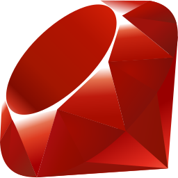

### Hi, I'm Sam!

- I'm a full stack developer currently working at a medical technology nonprofit
- My main interests are emulation and operating systems
- Outside of computing my hobbies include basketball, chess, and swimming
- Passionate about open source. Favorite OSS: [Dolphin](https://github.com/dolphin-emu/dolphin)
- Let's code for good!

    
    
     
    
    
    
    
    
     

